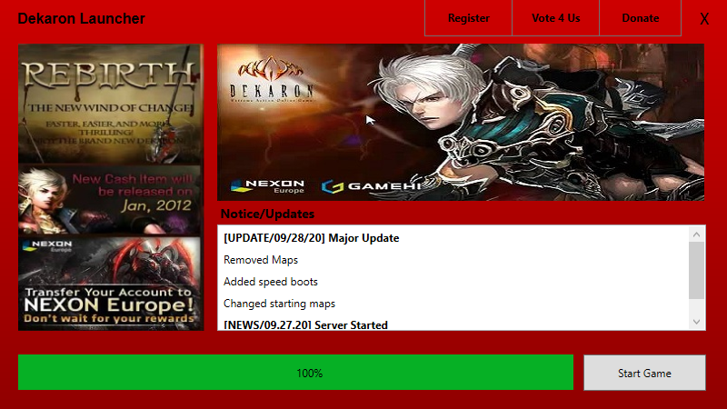

### Example server files
- 1.zip
- 2.zip
- 3.zip
- news.txt
  ```
  [UPDATE/09/28/20] Major Update
  >Removed Maps
  >Added speed boots
  >Changed starting maps
  [NEWS/09.27.20] Server Started
  ```
- version
  ```
  1
  ```
  
### Compiled Launcher files
##### https://github.com/pokballs/DekaronLauncher/releases/tag/1.0.0
 - dekaron.ico
 - DekaronLauncher.exe
 - DekaronLauncher.exe.config
 - DekaronLauncher.pdb
 - INIFileParser.dll
 - INIFileParser.xml
 - settings.ini
 - side.jpg
 - top.jpg
 
 #### Settings.ini
 ```
[Settings]
; only 1,2,3...
version = 6
news = http://localhost/launcher/news.txt
; must end with /
update = http://localhost/launcher/ 

[Window]
title = Dekaron Launcher

[Buttons]
; leave empty to hide button
button1 = Register
link1 = https://google.com
button2 = Vote 4 Us
link2 = https://yahoo.com
button3 = 
link3 = 
 ```


